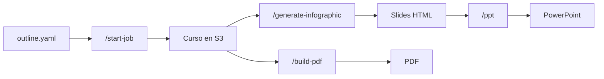

# Creación de contenidos en Thor (backend SAM)

Este documento explica cómo funciona el backend de **Thor** para generar cursos, slides y PDFs.

**Alcance:** solo lo que se despliega con SAM en `CG-Backend/`. No cubre el frontend ni otros servicios AWS fuera de este stack.

| Dato | Valor |
|------|-------|
| Stack | `crewai-course-generator-stack` |
| Región | `us-east-1` |
| Perfil AWS | `Netec` |
| Código Lambda | Python 3.12 (arm64) |

---

## ¿Qué es SAM y cómo se usa en Thor?

### ¿Qué es SAM?

**SAM** (AWS Serverless Application Model) es la herramienta de AWS para desplegar aplicaciones **serverless**: Lambdas, APIs, Step Functions, etc., sin configurar cada recurso a mano en la consola.

En la práctica, SAM funciona así:

1. Describes toda la infraestructura en un archivo YAML (`template.yaml`)
2. Escribes el código Python en carpetas locales (`lambda/`)
3. Ejecutas `sam build` (prepara paquetes y dependencias)
4. Ejecutas `sam deploy` (sube todo a AWS y crea o actualiza los recursos)

SAM es, en esencia, **Infrastructure as Code**: el backend de Thor vive definido en archivos del repo, no solo en la consola de AWS.

### Qué despliega SAM en este proyecto

Cuando haces `sam deploy`, SAM crea y mantiene un **stack** de CloudFormation llamado `crewai-course-generator-stack`. Ese stack incluye, entre otros:

| Recurso | Para qué sirve en Thor |
|---------|------------------------|
| **Lambdas** | Cada función del pipeline (generar lecciones, imágenes, slides, PDF, etc.) |
| **API Gateway** | Expone las rutas HTTP (`/start-job`, `/generate-infographic`, …) |
| **Step Functions** | Orquestan los 3 pipelines (curso, slides, PDF) |
| **Lambda Layers** | Librerías compartidas (PDF, PPT, Gemini, Strands) |
| **CloudWatch Alarms** | Alertas si falla la generación de cursos |
| **DynamoDB** | Tablas de asignación de cursos (acceso, no generación) |

Lo que **no** crea SAM (pero el stack lo usa):

- El bucket S3 `crewai-course-artifacts` (ya existe; SAM solo le da permisos)
- Los secretos de API keys en Secrets Manager
- Cognito (autenticación de usuarios)

### Archivos SAM del proyecto

Todo vive en la carpeta `CG-Backend/`:

```
CG-Backend/
├── template.yaml              ← Define TODOS los recursos AWS
├── samconfig.toml             ← Config de despliegue (stack, región, perfil)
├── current_state_machine.json ← Flujo del pipeline de curso
├── ppt_batch_orchestrator_state_machine.json
├── pdf_generation_state_machine.json
├── lambda/                    ← Código Python de cada función
├── lambda-layers/             ← Dependencias (PDF, PPT, etc.)
└── schemas/                   ← Reglas de validación de contenido
```

**`template.yaml`** es el archivo central. Ahí se declara, por ejemplo:

- qué Lambdas existen y qué código ejecutan (`Handler`, `CodeUri`)
- qué rutas de API las invocan (`Events: Api`)
- qué permisos tienen (acceso a S3, Bedrock, etc.)
- cómo se conectan las Step Functions con las Lambdas

### Cómo se usa en el día a día

**Desplegar cambios al backend:**

```bash
cd CG-Backend
sam build && sam deploy
```

| Comando | Qué hace |
|---------|----------|
| `sam build` | Empaqueta el código de `lambda/` y construye las capas Pdf y PPT desde sus `requirements.txt` |
| `sam deploy` | Sube los paquetes a AWS y actualiza el stack (Lambdas, APIs, Step Functions, etc.) |

> Siempre ejecuta **`sam build` antes de `sam deploy`**. Sin build, las capas de dependencias (PDF, PPT) no se actualizan.

**Perfil AWS:** usa `Netec` (configurado en `.envrc` del repo).

**Flujo típico al modificar código:**

```
1. Editar un archivo en lambda/  (ej. strands_content_gen.py)
2. sam build && sam deploy
3. La Lambda actualizada ya responde en la API
```

No hace falta subir zips manualmente ni tocar la consola de AWS para cada cambio.

### Capas de dependencias (Layers)

Algunas Lambdas comparten librerías pesadas (generar PDF, PowerPoint, etc.). Esas librerías van en **Layers** definidos en `template.yaml`:

| Layer | Se construye con | Contiene |
|-------|------------------|----------|
| `PdfLayer` | `sam build` (automático) | xhtml2pdf, jinja2 |
| `PPTLayer` | `sam build` (automático) | python-pptx, Pillow |
| `StrandsAgentsLayer` | Zip precompilado | SDK Strands |
| `GeminiLayer` | Zip precompilado | Google AI, Pillow |

Para agregar una dependencia a PDF o PPT: edita el `requirements.txt` de la capa y vuelve a hacer `sam build && sam deploy`.

### Relación SAM ↔ pipelines de Thor

Así encaja SAM con lo que hace Thor:

```
template.yaml
    │
    ├── Define StarterApiFunction + ruta POST /start-job
    │       └── Invoca CourseGeneratorStateMachine (Step Functions)
    │               └── Invoca Lambdas de generación de curso
    │
    ├── Define PptBatchOrchestrator + ruta POST /generate-infographic
    │       └── Invoca PptBatchOrchestrator (Step Functions)
    │               └── Invoca Lambdas de slides
    │
    └── Define PdfStarterFunction + ruta POST /build-pdf
            └── Invoca PdfGenerationStateMachine (Step Functions)
                    └── Invoca BookToPdfFunction
```

SAM no ejecuta la generación de contenido: **define y despliega** la infraestructura. La lógica de negocio está en `lambda/`; la orquestación en los JSON de Step Functions.

---

## ¿Qué hace el sistema?

Thor toma un **plan del curso** (`outline.yaml`) y produce material educativo de forma automática:

1. **Curso** → lecciones, imágenes, libro teórico y guías de laboratorio  
2. **Slides** → presentación en HTML (y PPTX si se pide)  
3. **PDF** → libro exportado en PDF  

Todo se guarda en **S3** (`crewai-course-artifacts`).

---

## Flujo completo (de principio a fin)

```
1. Subir outline.yaml a S3
         ↓
2. POST /start-job  →  genera curso (lecciones + labs + imágenes)
         ↓
3. (Opcional) Editar libro con load-book / save-book
         ↓
4. POST /generate-infographic  →  crea slides HTML
         ↓
5. POST /build-pdf  →  exporta PDF
   GET  /infographic/{carpeta}/ppt  →  exporta PowerPoint
```

---

## Los 3 pipelines principales

### 1. Generación de curso

**Cómo se inicia:** `POST /start-job`

**Qué pasa por dentro:**

Step Functions (`CourseGeneratorStateMachine`) coordina varias Lambdas en orden:

```
Outline YAML
    ↓
Escribir lecciones (IA)          →  archivos .md en S3
    ↓
Detectar imágenes necesarias     →  prompts en S3
    ↓
Generar imágenes (Gemini/OpenAI) →  imágenes en S3
    ↓
Armar libro teórico              →  book.json
    ↓
(E si content_type = "both" o "labs")
Planificar labs → Escribir labs → Armar libro de labs
    ↓
Enviar email de aviso (SES)
```

**Tipos de contenido** (`content_type`):

| Valor | Qué genera |
|-------|------------|
| `theory` | Solo lecciones y libro teórico |
| `labs` | Solo guías de laboratorio |
| `both` | Teoría y labs (lo más común) |

**Lambdas clave del pipeline de curso:**

| Lambda | Qué hace |
|--------|----------|
| `StarterApiFunction` | Recibe la petición y arranca Step Functions |
| `BatchExpander` | Divide el curso en tareas pequeñas (1 lección por tarea) |
| `StrandsContentGen` | Escribe las lecciones con Claude (Bedrock) |
| `StrandsVisualPlanner` | Busca `[VISUAL: ...]` en el texto y prepara prompts de imagen |
| `ImagesGen` | Genera las imágenes |
| `BookBuilder` | Junta todo en un libro JSON |
| `StrandsLabPlanner` | Planifica los laboratorios |
| `StrandsLabWriter` | Escribe cada guía de lab |
| `LabGuideBuilder` | Arma el libro de labs |
| `ContentValidator` | Revisa formato (no detiene el proceso si falla) |
| `StrandsNotification` | Manda email al terminar |

Las tareas se procesan **de una en una** (`MaxConcurrency: 1`) para no saturar Bedrock.

---

### 2. Generación de slides

**Cómo se inicia:** `POST /generate-infographic`

**Entrada:** el libro JSON ya generado (en S3).

**Qué pasa por dentro:**

```
Libro JSON
    ↓
Dividir lecciones en lotes
    ↓
Generar slides HTML por lote (Claude + Strands Agent)
    ↓
(Opcional) Unir todos los lotes en una sola presentación
    ↓
Guardar HTML en S3
```

**Lambdas clave:**

| Lambda | Qué hace |
|--------|----------|
| `PptBatchOrchestrator` | Lee el libro, crea lotes e inicia Step Functions |
| `StrandsInfographicGenerator` | Genera slides HTML (`html_first_generator.py`) |
| `StrandsPptMerger` | Combina lotes en un solo HTML |
| `ExportPptFunction` | Convierte HTML → PPTX bajo demanda |

**Importante:** el formato principal es **HTML**. El PowerPoint es una exportación extra.

**Otras APIs de slides:**

| Método | Ruta | Para qué |
|--------|------|----------|
| GET | `/list-infographics` | Ver proyectos con slides |
| GET | `/infographic/{carpeta}` | Ver una presentación |
| PUT | `/infographic` | Editar slides |
| GET | `/infographic/{carpeta}/ppt` | Descargar PPTX |

---

### 3. Exportación PDF

**Cómo se inicia:** `POST /build-pdf`

```
Libro JSON → BookToPdfFunction → PDF en S3 + URL de descarga
```

La Lambda `BookToPdfFunction` usa plantillas Jinja2 y la librería `xhtml2pdf`.

El body puede usar `action: "start"` (iniciar) o `action: "check"` (consultar estado).

---

## APIs principales

Base URL: output `ApiBaseUrl` del stack (ej. `https://{id}.execute-api.us-east-1.amazonaws.com/Prod`).

### Generar y consultar

| Método | Ruta | Descripción |
|--------|------|-------------|
| POST | `/start-job` | Iniciar generación de curso |
| GET | `/exec-status/{executionArn}` | Ver si terminó el job |
| POST | `/presign` | URL para subir el outline a S3 |
| POST | `/generate-infographic` | Iniciar slides |
| POST | `/build-pdf` | Iniciar o consultar PDF |

### Editar contenido

| Método | Ruta | Descripción |
|--------|------|-------------|
| GET | `/list-projects` | Listar proyectos |
| GET | `/load-book/{carpeta}` | Cargar libro |
| POST | `/save-book` | Guardar cambios |
| POST | `/build-book` | Reconstruir libro teórico |
| POST | `/build-lab-guide` | Reconstruir libro de labs |
| POST | `/publish-labs-github` | Publicar labs en GitHub |

### Ejemplo: iniciar un curso completo

```bash
curl -X POST "https://{API_ID}.execute-api.us-east-1.amazonaws.com/Prod/start-job" \
  -H "Content-Type: application/json" \
  -d '{
    "course_bucket": "crewai-course-artifacts",
    "outline_s3_key": "250618-mi-curso-01/outline.yaml",
    "project_folder": "250618-mi-curso-01",
    "content_type": "both",
    "model_provider": "bedrock",
    "user_email": "instructor@empresa.com"
  }'
```

### Parámetros útiles de `/start-job`

| Parámetro | Descripción |
|-----------|-------------|
| `course_bucket` | Bucket S3 (requerido) |
| `outline_s3_key` | Ruta al outline (requerido) |
| `project_folder` | Carpeta del proyecto en S3 (requerido) |
| `content_type` | `theory`, `labs` o `both` |
| `module_number` | Módulos a generar: `"all"`, `"1"`, `"1,3"`, `"1-3"` |
| `model_provider` | `bedrock` (default) u `openai` |
| `image_model` | Modelo de imágenes (default: Gemini) |
| `user_email` | Email para aviso al terminar |
| `lesson_to_generate` | Regenerar solo una lección |
| `lab_ids_to_regenerate` | Regenerar solo algunos labs |

---

## Dónde se guarda todo (S3)

Cada proyecto vive en una carpeta, por ejemplo `250618-mi-curso-01/`:

```
250618-mi-curso-01/
├── outline.yaml           ← plan del curso (entrada)
├── lessons/               ← lecciones en Markdown
├── prompts/               ← prompts para imágenes
├── images/                ← imágenes generadas
├── theory-book/           ← libro teórico (book.json)
├── lab-book/              ← libro de labs
├── versions/              ← versiones anteriores del libro
├── infographic/           ← slides HTML
└── exports/               ← PPTX exportado
```

### Formato del outline (resumen)

Ver ejemplo completo en `outline-example.yaml`:

```yaml
course:
  title: "Mi curso"
  language: es
  modules:
    - title: "Módulo 1"
      lessons:
        - title: "Lección 1"
          topics:
            - title: "Tema 1"
      lab_activities:
        - title: "Lab 1"
          objective: "Practicar X"
```

---

## Servicios de IA e integraciones

| Servicio | Para qué | Modelo / notas |
|----------|----------|----------------|
| **Amazon Bedrock** | Texto (lecciones, labs, slides) | Claude Sonnet 4.6 |
| **Google Gemini** | Imágenes (default) | vía Secrets Manager |
| **OpenAI** | Texto e imágenes (alternativa) | gpt-5, gpt-image-2 |
| **Amazon SES** | Emails al terminar jobs | requiere email verificado |
| **GitHub** | Publicar labs | GitHub App en Secrets Manager |

Los API keys están en **AWS Secrets Manager**. Los nombres de los secretos en AWS aún usan el prefijo legacy `aurora/` (ej. `aurora/google-api-key-*`, `aurora/openai-api-key-*`).

---

## Infraestructura SAM (resumen)

Detalle de despliegue y archivos: ver sección [¿Qué es SAM y cómo se usa en Thor?](#qué-es-sam-y-cómo-se-usa-en-thor).

### Step Functions (orquestadores)

| Nombre | Pipeline |
|--------|----------|
| `CourseGeneratorStateMachine` | Curso completo |
| `PptBatchOrchestrator` | Slides |
| `PdfGenerationStateMachine` | PDF |

Definidos en los JSON de `CG-Backend/` (ver arriba).

### Recursos externos (no los crea SAM)

- Bucket S3: `crewai-course-artifacts`
- Bucket legacy: `netec-course-generator-content`
- Cognito user pool: `us-east-1_B7QVYyDGp`

---

## Código fuente (dónde está cada cosa)

Todo el backend vive en `CG-Backend/lambda/`:

| Carpeta / archivo | Responsabilidad |
|-------------------|-----------------|
| `starter_api.py` | Entrada del pipeline de curso |
| `batch_expander.py` | Divide lecciones en tareas |
| `strands_content_gen/` | Escribe lecciones |
| `strands_visual_planner/` | Prepara imágenes |
| `images_gen/` | Genera imágenes |
| `book_builder.py` | Arma libro teórico |
| `strands_lab_planner/` + `strands_lab_writer/` | Labs |
| `lab_guide_builder.py` | Arma libro de labs |
| `ppt_batch_orchestrator/` | Entrada del pipeline de slides |
| `strands_infographic_generator/` | Motor de slides HTML |
| `ppt_merger/` | Merge HTML y export PPTX |
| `book_to_pdf/` | Genera PDF |
| `pdf_starter.py` | Entrada del pipeline PDF |

Esquemas de validación Thor: `CG-Backend/schemas/` (también en S3 bajo `schemas/`).

Configuración SAM: `template.yaml` y `samconfig.toml`.

---

## Despliegue

Ver la sección [¿Qué es SAM y cómo se usa en Thor?](#qué-es-sam-y-cómo-se-usa-en-thor) para el flujo completo.

Resumen:

```bash
cd CG-Backend
sam build && sam deploy
```

Perfil `Netec`, stack `crewai-course-generator-stack`, región `us-east-1`.

---

## Si algo falla

### Reintentar la misma ejecución (redrive)

Sirve cuando el error fue temporal (throttling, caída breve de Bedrock):

```bash
aws stepfunctions redrive-execution \
  --execution-arn "arn:aws:states:..." \
  --profile Netec
```

### Regenerar solo parte del curso

Lanzar un **nuevo** job con:

```json
{
  "lesson_to_generate": "module-01-lesson-02",
  "lesson_requirements": "Agregar más ejemplos",
  "lab_ids_to_regenerate": ["04-00-01"]
}
```

### Dónde mirar logs

1. Consola de **Step Functions** → buscar la ejecución fallida  
2. Ver qué paso falló  
3. Revisar logs en CloudWatch: `/aws/lambda/{nombre-de-la-lambda}`

### Problemas frecuentes

| Síntoma | Qué hacer |
|---------|-----------|
| Timeout en generación | Normal con lotes grandes; ya se usa 1 lección por lote |
| Throttling Bedrock | Redrive o esperar y reintentar |
| No llega el email | Verificar que `user_email` esté verificado en SES |
| Slides sin merge | Enviar `auto_combine: true` en `/generate-infographic` |

---

## Diagrama general



---

## Archivos de referencia

| Archivo | Contenido |
|---------|-----------|
| `template.yaml` | Definición completa del stack |
| `current_state_machine.json` | Flujo de generación de curso |
| `ppt_batch_orchestrator_state_machine.json` | Flujo de slides |
| `pdf_generation_state_machine.json` | Flujo de PDF |
| `outline-example.yaml` | Ejemplo de outline |
| `RUNBOOK_COURSE_PIPELINE.md` | Guía operativa detallada |
| `AGENTS.md` | Instrucciones de despliegue |

---

*Documentación del backend SAM de Thor — stack `crewai-course-generator-stack`.*
